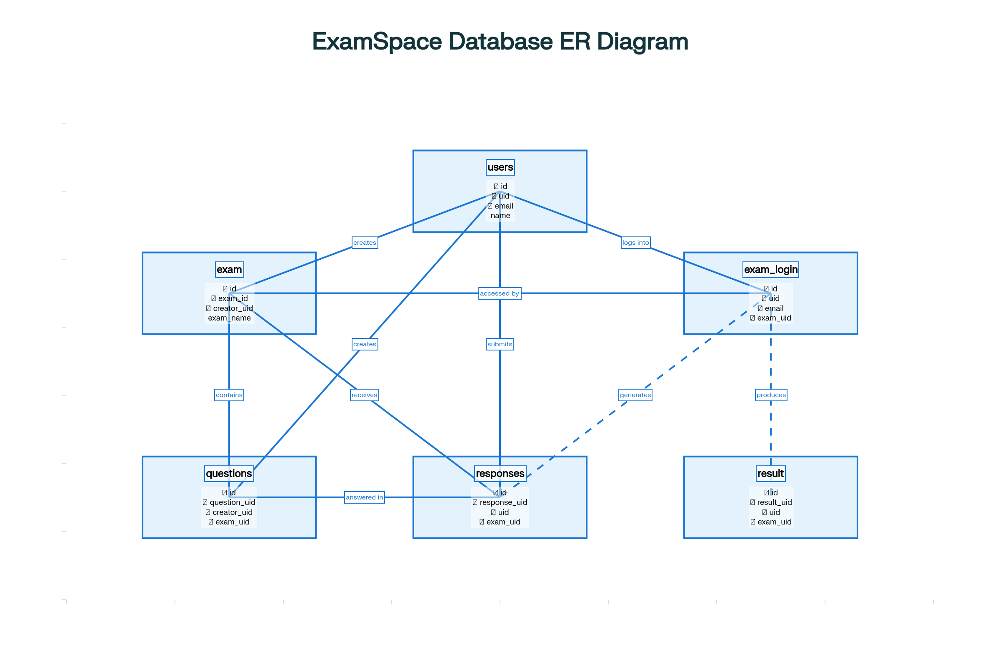

# ExamSpace - Online Assessment Platform

<div align="center">    </div>

## 🎯 About The Project

**ExamSpace** is a modern, open-source online assessment platform designed to revolutionize the way educational institutions conduct examinations. Built with scalability, security, and user experience in mind, ExamSpace provides a comprehensive solution for creating, managing, and taking online exams.

### 🌟 Why ExamSpace?

- **🔒 Security First**: Advanced anti-cheating measures and secure authentication
- **🤖 AI-Powered**: Intelligent question generation using Cohere API
- **📱 Responsive Design**: Works seamlessly across all devices
- **🔧 Highly Configurable**: Flexible exam settings and customization options
- **📊 Analytics Ready**: Comprehensive reporting and performance insights
- **⚡ High-Performance Caching**: In-memory caching with Caffeine (backend) and browser storage (frontend) for fast and efficient data retrieval

## ✨ Features

### 👤 User Management & Security

- JWT Authentication: Secure token-based authentication system
- Multi-Factor Authentication: OTP verification for registration and password recovery
- Email Verification: Secure email confirmation for account activation
- Profile Management: Update personal information and preferences
- Password Security: Encrypted password storage with reset functionality

### 📝 Exam Creation & Management

- Intuitive Exam Builder: Create exams with flexible question types
- AI Question Generation: Generate questions using Cohere API integration
- Passcode Protection: Secure exams with custom passcodes
- Sharing System: Share exams with specific users or groups

### 🖥️ Exam Taking Experience

- Clean Interface: Distraction-free exam environment
- Fullscreen Mode: Enforced fullscreen for secure testing
- Anti-Cheating: Tab or screen switching detection and monitoring

### 📊 Analytics & Reporting (Not available in public version)

- Performance Dashboard: Comprehensive exam statistics
- Question Analysis: Identify difficult questions and common mistakes
- Export Options: Generate reports in PDF, Excel formats
- Result Publishing: Control when and how results are released

### ⚡ Caching & Performance (Not available in public version)

- **Backend (Caffeine)**: Fast, in-memory caching for frequently accessed data, up to 512MB, 15-minute expiry, with real-time statistics
- **Frontend (Browser Storage)**: LocalStorage/sessionStorage caching via a dedicated service, with configurable expiry and cache management for API responses and user data

## 🛠️ Technology Stack

### Backend Technologies

```
Language: Java 21 (LTS)
Framework: Spring Boot 3.5.3
Security: Spring Security with JWT
Database: MariaDB 10.11+
ORM: Spring Data JPA with Hibernate
Email: JavaMail API
AI Integration: Cohere API
OCR: Tesseract 4.x
Caching: Caffeine (Spring Cache abstraction)
Build Tool: Maven 3.9+
Testing: JUnit 5, Mockito
Documentation: OpenAPI 3 (Swagger)
```

### Frontend Technologies

```
Framework: React 19.1.0
Build Tool: Vite 7.0.0
Language: JavaScript (ES2022+)
Styling: CSS3 with Flexbox/Grid
HTTP Client: Fetch API
Routing: React Router DOM 6.x
State Management: React Hooks
Caching: LocalStorage/sessionStorage via CacheService.js and useCachedFetch.js
Testing: React Testing Library, Jest
```

### DevOps & Infrastructure

```
Version Control: Git
CI/CD: GitHub Actions
Containerization: Docker & Docker Compose
Web Server: Embedded Tomcat
```

## 🌐 Deployment Architecture

ExamSpace uses a distributed architecture with integrated caching on both backend and frontend:

```
                            ┌───────────────────────────────┐
                            │       React SPA (Vercel)      │
                            │       ───────────────────     │
                            │  - Frontend hosted on Vercel  │
                            │  - Uses Browser Storage Cache │
                            │    (localStorage / session)   │
                            └──────────────┬────────────────┘
                                           │
                                           ▼
                           ┌───────────────────────────────────┐
                           │   Cloudflare Tunnel (Secure API)  │
                           │ - Exposes backend from home       │
                           │ - No port forwarding required     │
                           └──────────────┬────────────────────┘
                                          │
                                          ▼
                      ┌────────────────────────────────────────────┐
                      │       Raspberry Pi (Home Server)           │
                      │  ────────────────────────────────────────  │
                      │       Dockerized Spring Boot Backend       │
                      │    - Handles business logic & routing      │
                      │    - Connected to Caffeine Cache           │
                      │                                            │
                      │    ┌──────────────────────────────┐        │
                      │    │       Caffeine Cache         │        │
                      │    │ - In-memory Java caching     │        │
                      │    └──────────────────────────────┘        │
                      └──────────────────┬─────────────────────────┘
                                         │
                                         ▼
                            ┌────────────────────────────┐
                            │      MariaDB Database      │
                            │   - Native on Raspberry Pi │
                            │   - Stores persistent data │
                            └────────────────────────────┘

```

### Key Components

- **React SPA (Vercel):** Frontend delivered globally, with browser-side caching for API responses and user data.
- **Browser Storage Cache:**  
  - Managed via `CacheService.js` and `useCachedFetch.js`
  - Supports localStorage/sessionStorage, configurable expiry, and cache clearing on logout or refresh
- **Dockerized Backend (Raspberry Pi):**  
  - Spring Boot application with integrated Caffeine in-memory cache for questions, exams, users, results, exam logins, and responses
  - Configured for up to 512MB memory, 15-minute expiry, and statistics monitoring
- **MariaDB Database:** Persistent storage, running natively on Raspberry Pi
- **Cloudflare Tunnel:** Secure API exposure without port forwarding
- **Vercel Platform:** Frontend hosting and edge delivery

## 🔄 Deployment Flow

1. Developer pushes changes to GitHub repository
2. GitHub Actions workflow triggers on the self-hosted Raspberry Pi runner
3. Backend is built with Maven and packaged into a Docker container
4. Container is deployed locally on the Raspberry Pi
5. API is exposed through Cloudflare Tunnel
6. Frontend changes are automatically deployed by Vercel
7. New version is immediately available at [https://exam-space.vercel.app/](https://exam-space.vercel.app/)

# 📚 API Documentation

## Authentication Endpoints

```http
POST /users/register            # Register a new user
POST /users/login               # User login with credentials
POST /users/refresh-token       # Refresh authentication token
POST /users/otp                 # Generate OTP for signup/password reset
POST /users/reset-password      # Reset user password
PUT  /users/update-profile      # Update user profile information
POST /users/send_mail           # Send contact email to administrators
```

## Exam Management Endpoints

```http
POST   /exam/upload                           # Upload files for content extraction
POST   /exam/create                           # Create a new exam
GET    /exam/my-exams/{userId}                # Get exams created by a user
GET    /exam/{examId}                         # Get exam by ID
PUT    /exam/{examId}                         # Update an exam
DELETE /exam/{examId}                         # Delete an exam
GET    /exam/shared-exams?email={email}       # Get exams shared with a specific email
```

## Question Management Endpoints

```http
POST   /exam/generate-questions                # Generate AI questions for an exam
POST   /exam/generate-questions-from-content   # Generate questions from uploaded content
POST   /exam/add-question                      # Add a question to an exam
PUT    /exam/question/{questionUid}            # Update a question
DELETE /exam/question/{questionUid}            # Delete a question
GET    /exam/{examId}/questions                # Get questions for an exam
```

## Exam Taking Endpoints

```http
POST   /take-exam/register                     # Register for an exam
POST   /take-exam/submit                       # Submit exam responses
GET    /take-exam/responses                    # Get exam responses for an exam
DELETE /take-exam/delete-login                 # Delete exam login entry
GET    /take-exam/user-summary                 # Get user exam summary
```

## 🗄️ Database Schema

ExamSpace uses a robust relational database schema with proper constraints and relationships.

### Entity Relationships Diagram

<div align="center">
  
</div>

### Database Tables and Relationships

Check if MariaDB is already running:
**sudo systemctl status mariadb**


Start it if it’s not running:
**sudo systemctl start mariadb**

you can login with:
**mysql -u username -p**      username --> check in application.properties and if asks for password, provide from the same file


#### Users Table

```sql
CREATE TABLE `users` (
  `id` bigint(20) NOT NULL AUTO_INCREMENT,
  `created_at` datetime DEFAULT current_timestamp(),
  `uid` varchar(255) NOT NULL,
  `name` varchar(255) NOT NULL,
  `phone` varchar(50) DEFAULT NULL,
  `email` varchar(255) NOT NULL,
  `password` text NOT NULL,
  `last_login` datetime DEFAULT NULL,
  PRIMARY KEY (`id`),
  UNIQUE KEY `uid` (`uid`),
  UNIQUE KEY `email` (`email`)
)
```

#### Exam Table

```sql
CREATE TABLE `exam` (
  `id` bigint(20) NOT NULL AUTO_INCREMENT,
  `exam_id` varchar(255) NOT NULL,
  `creator_uid` varchar(255) NOT NULL,
  `marks` int(11) DEFAULT NULL,
  `created_at` datetime DEFAULT current_timestamp(),
  `state` enum('ON','OFF') DEFAULT 'OFF' COMMENT 'Exam availability state',
  `exam_name` varchar(255) DEFAULT NULL COMMENT 'Name of the exam',
  `exam_passcode` varchar(255) DEFAULT NULL COMMENT 'Optional passcode for the exam',
  `sharing` text DEFAULT NULL,
  `result_publish` enum('YES','NO') DEFAULT 'NO',
  PRIMARY KEY (`id`),
  UNIQUE KEY `uq_exam_id` (`exam_id`),
  KEY `creator_uid` (`creator_uid`),
  CONSTRAINT `exam_ibfk_1` FOREIGN KEY (`creator_uid`) REFERENCES `users` (`uid`) ON DELETE CASCADE ON UPDATE CASCADE
)
```

#### Questions Table

```sql
CREATE TABLE `questions` (
  `id` bigint(20) NOT NULL AUTO_INCREMENT,
  `question_uid` varchar(255) NOT NULL,
  `creator_uid` varchar(255) NOT NULL,
  `exam_uid` varchar(255) NOT NULL,
  `question` text NOT NULL,
  `option_a` text DEFAULT NULL,
  `option_b` text DEFAULT NULL,
  `option_c` text DEFAULT NULL,
  `option_d` text DEFAULT NULL,
  `correct_ans` enum('A','B','C','D') NOT NULL,
  `created_at` datetime DEFAULT current_timestamp(),
  PRIMARY KEY (`id`),
  UNIQUE KEY `uk_question_uid` (`question_uid`),
  KEY `fk_questions_creator_uid` (`creator_uid`),
  KEY `fk_questions_exam_uid` (`exam_uid`),
  CONSTRAINT `fk_questions_creator_uid` FOREIGN KEY (`creator_uid`) REFERENCES `users` (`uid`) ON DELETE CASCADE ON UPDATE CASCADE,
  CONSTRAINT `fk_questions_exam_uid` FOREIGN KEY (`exam_uid`) REFERENCES `exam` (`exam_id`) ON DELETE CASCADE ON UPDATE CASCADE
)
```

#### Exam Login Table

```sql
CREATE TABLE `exam_login` (
  `id` bigint(20) NOT NULL AUTO_INCREMENT,
  `uid` varchar(255) NOT NULL,
  `name` varchar(255) NOT NULL,
  `email` varchar(255) NOT NULL,
  `username` varchar(255) DEFAULT NULL,
  `roll` text DEFAULT NULL,
  `exam_uid` varchar(255) NOT NULL,
  `exam_name` varchar(255) NOT NULL,
  `submission_datetime` datetime DEFAULT NULL,
  `last_login` datetime DEFAULT current_timestamp(),
  PRIMARY KEY (`id`),
  UNIQUE KEY `uq_examlogin_uid_examuid` (`uid`,`exam_uid`),
  KEY `fk_exam_login_user_email` (`email`),
  KEY `fk_examlogin_exam` (`exam_uid`),
  CONSTRAINT `fk_exam_login_user_email` FOREIGN KEY (`email`) REFERENCES `users` (`email`) ON DELETE CASCADE,
  CONSTRAINT `fk_exam_login_user_uid` FOREIGN KEY (`uid`) REFERENCES `users` (`uid`) ON DELETE CASCADE,
  CONSTRAINT `fk_examlogin_exam` FOREIGN KEY (`exam_uid`) REFERENCES `exam` (`exam_id`) ON DELETE CASCADE
)
```

#### Responses Table

```sql
CREATE TABLE `responses` (
  `id` bigint(20) NOT NULL AUTO_INCREMENT,
  `response_uid` varchar(255) NOT NULL,
  `uid` varchar(255) NOT NULL,
  `exam_uid` varchar(255) NOT NULL,
  `exam_name` varchar(255) NOT NULL,
  `question_uid` varchar(255) NOT NULL,
  `question` text NOT NULL,
  `response` text NOT NULL,
  `current_datetime` datetime DEFAULT current_timestamp(),
  PRIMARY KEY (`id`),
  UNIQUE KEY `response_uid` (`response_uid`),
  KEY `fk_response_exam_uid` (`exam_uid`),
  KEY `fk_response_question_uid` (`question_uid`),
  KEY `fk_responses_examlogin` (`uid`,`exam_uid`),
  CONSTRAINT `fk_response_exam_uid` FOREIGN KEY (`exam_uid`) REFERENCES `exam` (`exam_id`) ON DELETE CASCADE ON UPDATE CASCADE,
  CONSTRAINT `fk_response_question_uid` FOREIGN KEY (`question_uid`) REFERENCES `questions` (`question_uid`) ON DELETE CASCADE ON UPDATE CASCADE,
  CONSTRAINT `fk_response_user_uid` FOREIGN KEY (`uid`) REFERENCES `users` (`uid`) ON DELETE CASCADE ON UPDATE CASCADE,
  CONSTRAINT `fk_responses_examlogin` FOREIGN KEY (`uid`, `exam_uid`) REFERENCES `exam_login` (`uid`, `exam_uid`) ON DELETE CASCADE
)
```

#### Result Table

```sql
CREATE TABLE `result` (
  `id` bigint(20) NOT NULL AUTO_INCREMENT,
  `result_uid` varchar(255) NOT NULL,
  `uid` varchar(255) NOT NULL,
  `exam_uid` varchar(255) NOT NULL,
  `exam_name` varchar(255) NOT NULL,
  `full_marks` int(11) NOT NULL,
  `marks_obtained` int(11) NOT NULL,
  `percentage` decimal(5,2) NOT NULL,
  `total_right_answers` int(11) NOT NULL,
  `total_wrong_answers` int(11) NOT NULL,
  `created_at` datetime DEFAULT current_timestamp(),
  PRIMARY KEY (`id`),
  UNIQUE KEY `result_uid` (`result_uid`),
  KEY `fk_result_examlogin` (`uid`,`exam_uid`),
  KEY `fk_result_exam` (`exam_uid`),
  CONSTRAINT `fk_result_exam` FOREIGN KEY (`exam_uid`) REFERENCES `exam` (`exam_id`) ON DELETE CASCADE,
  CONSTRAINT `fk_result_examlogin` FOREIGN KEY (`uid`, `exam_uid`) REFERENCES `exam_login` (`uid`, `exam_uid`) ON DELETE CASCADE
)
```

## 📜 License

This software is licensed under a **Non-Commercial License**.  
You are free to use, copy, and modify it for personal, educational, and research purposes.  
**Commercial use is strictly prohibited.**  
See the LICENSE file for full terms.

## 👨‍💻 Developed By

ExamSpace was designed and developed by Shubhodip Pal.

GitHub: [Shubhodippal](https://github.com/Shubhodippal)  
LinkedIn: [Shubhodip Pal](https://www.linkedin.com/in/shubhodip-pal/)  
Email: shubhodippal01@gmail.com
